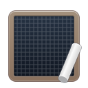
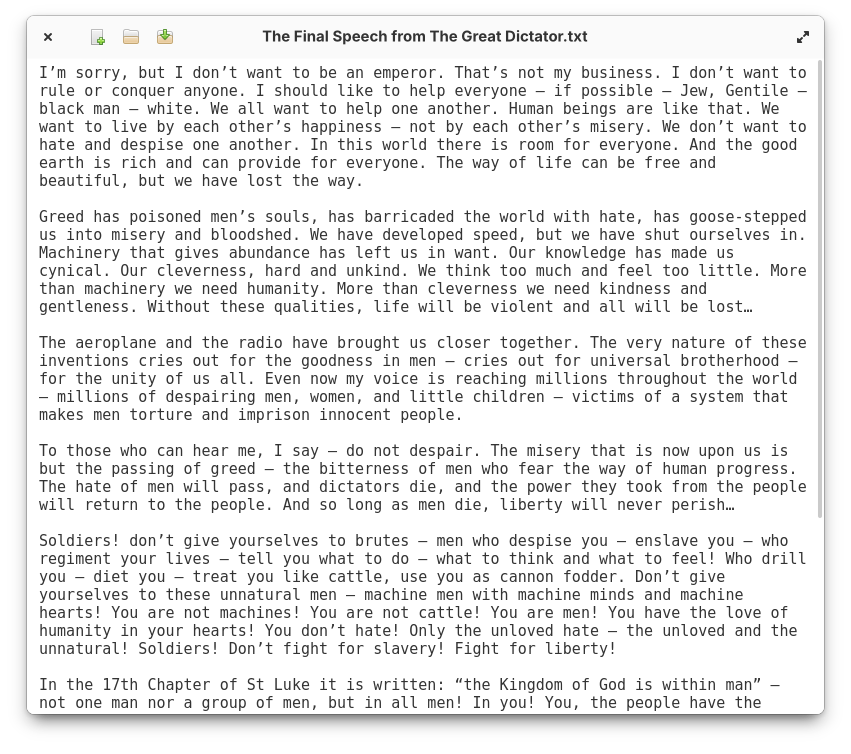

<div align="center">
  
  <h1>Slate</h1>
  <h3>The text editor that's dumb as rocks</h3>

[](http://www.gnu.org/licenses/gpl-3.0)
[](https://github.com/wpkelso/slate/actions/workflows/ci.yml)

  

  <a href="https://elementary.io">
    
  </a>
  <a href="https://appcenter.elementary.io/io.github.wpkelso.slate/">
    
  </a>
</div>

## Building

Make sure you have the following dependencies:

```bash
libgranite-7-dev
gtk-4.0
libgio-2.0
meson
valac
```

Clone the repository and run:

```bash
meson setup build --prefix=/usr
cd build
ninja
```

Then to install run:

```bash
sudo ninja install
```

To build flatpak:
```bash
flatpak-builder build io.github.wpkelso.slate.yaml --user --install --force-clean --install-deps-from=appcenter
```

